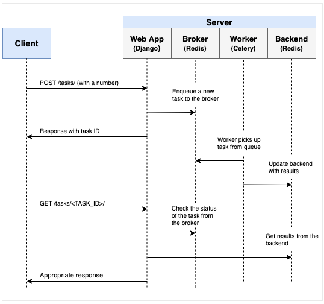

[<<<](../README.md) | [Project Setup >>>](102-project-setup.md)

# Objectives

1. Integrate Celery into a Django app and create tasks.
2. Containerize Django, Celery, and Redis with Docker
3. Run processes in the background with a separate worker process
4. Save Celery logs to a file
5. Set up `Flower` to monitor and administer Celery jobs and workers
6. Test a Celery task and both unit integrations tests

# Background Tasks

Again, to improve user experience, long-running processes should be run outside the normal HTTP request/response flow, in a background process.

Examples:

1. Running machine learning models
2. Sending confirmation emails
3. Web scraping and crawling
4. Analyzing data
5. Processing images
6. Generating reports

As you're building out an app, try to distinguish tasks that should run during the request/response lifecycle, like CRUD operations, from those that should run in the background.

# Workflow

Our goal is to develop a Django application that works in conjunction with Celery to handle long-running processes outside the normal request/response cycle.

1. The end user kicks off a new task via a POST request to the server-side.
2. Within the view, a task is added to the queue and the task id is sent back to the client-side.
3. Using AJAX, the client continues to poll the server to check the status of the task while the task itself is running in the background.

 | [Project Setup](102-project-setup.md)